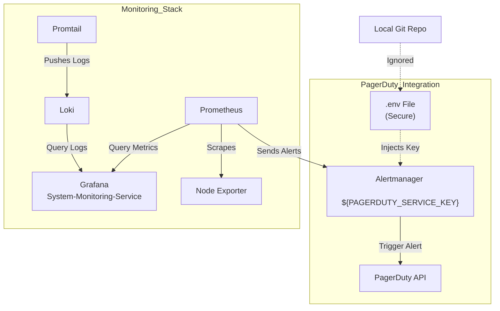

# DataDeck: Automated Monitoring & Alerting System

## Project Overview
This project provides a robust, industry-standard monitoring infrastructure designed for Linux servers. It ensures high availability and proactive issue resolution by integrating metrics collection, log aggregation, and real-time alerting.

## Tech Stack
* **Metrics Collection:** Prometheus, Node Exporter
* **Log Aggregation:** Loki, Promtail
* **Visualization:** Grafana
* **Alerting:** Alertmanager, PagerDuty
* **Infrastructure:** Docker, Docker Compose

## Key Features
* **Full-Stack Monitoring:** Real-time visualization of CPU utilization, memory usage, and network traffic.
* **Automated Alerting:** Configured custom alert rules (e.g., High CPU usage > 80%) with PagerDuty integration for immediate incident response.
* **Log Management:** Centralized logging with Grafana Loki to identify and troubleshoot application-level errors efficiently.
* **Service Health Tracking:** Uptime tracking and SLO monitoring.

## Security & Best Practices
* **Secret Management:** Implemented environment variables (`.env`) for sensitive configurations like PagerDuty service keys to ensure security.
* **Clean Repository:** Configured `.gitignore` to prevent sensitive data files and temporary system logs from being tracked in version control.

## Architecture Overview

## 💡 Key Learnings
During the development of this project, I gained hands-on experience in:
* Designing scalable monitoring architectures.
* Implementing secure secret management workflows.
* Optimizing PromQL queries for efficient data retrieval.
* Integrating third-party incident management tools (PagerDuty) for SRE operations.
